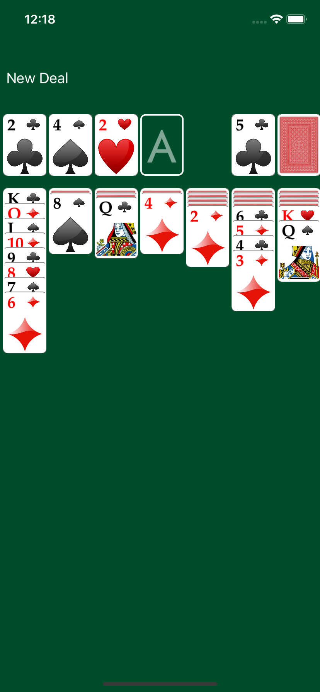

# Solitaire

This is an iOS implementation of the ubiquitous card game, written in Swift

|

## License

Solitaire is licensed under the MIT License. See the LICENSE file for more information, but basically this is sample code and you can do whatever you want with it.